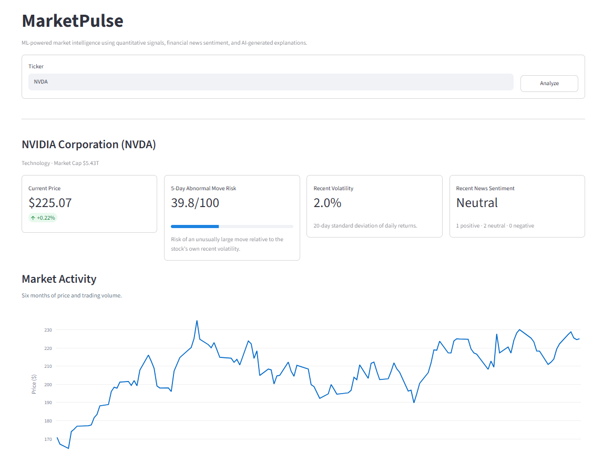

# MarketPulse

ML-powered market intelligence using quantitative signals, financial news sentiment, and AI-generated explanations.

<p align="center">
  
</p>

## Overview

MarketPulse analyzes a stock and combines market data, machine learning, and financial news into one dashboard.

It provides:

- **5-Day Abnormal Move Risk** using XGBoost
- **Price and volume history**
- **Model feature contributions** showing what is raising or lowering the score
- **Financial news sentiment** using FinBERT with Gemini review for context-sensitive headlines
- **AI-generated market summaries** combining quantitative signals and recent news

The abnormal-move score estimates whether a stock is likely to make a move that is unusually large relative to its own recent volatility.

## How It Works

```text
Market Data
    ↓
Feature Engineering
    ↓
XGBoost
    ↓
5-Day Abnormal Move Risk

Financial News
    ↓
FinBERT
    ↓
Optional Gemini Contextual Review
    ↓
Final News Sentiment

Model Signals + News
    ↓
Gemini
    ↓
AI Market Summary
```

## Tech Stack

- Python
- XGBoost
- pandas / NumPy / scikit-learn
- FinBERT / Hugging Face Transformers
- Google Gemini
- yfinance
- Marketaux
- Streamlit
- Plotly

## Run Locally

```bash
git clone https://github.com/ishanporwal/marketpulse.git
cd marketpulse

pip install -r requirements.txt

streamlit run app.py
```

Create a `.env` file with:

```env
GEMINI_API_KEY=your_key
MARKETAUX_API_KEY=your_key
NEWS_PROVIDER=marketaux
```
